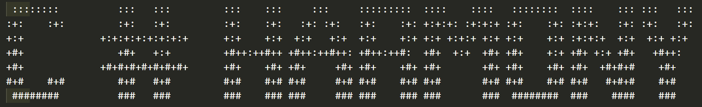

Welcome to C#Harmony, a platform to help musicians and bands connect with each other and request auditions! 

To Run the Application:

- Clone the repository down to your machine.
- From the top directory, run pipenv install & pipenv shell
- Move into the /lib/db and run python cli.py
- Start interacting!

Functionality:

From the main menu, users have the option of going into the Musician Hub, the Band Hub, or to a General Statistics page. From either the Musician Hub or the Band hub, both musicians and bands will have the ability to:

- Create a new profile if they are new to the platform
- Change and update profiles
- Search for musicians/bands through multiple filtering criteria (instrument, genre, etc.)
- Send and receive audition requests
- View any pending requests
- Accept or decline pending requests
- Delete requests from their profile

There are multiple [exit] prompts throughout the application that allow you to go back to the previous menu. If you want to quit the application, navigate back to the Main Menu and type [exit] to quit or press [ctrl+c] at any point to terminate the program.

Explore the application and have fun connecting with musicians/bands! 

Rock on!

